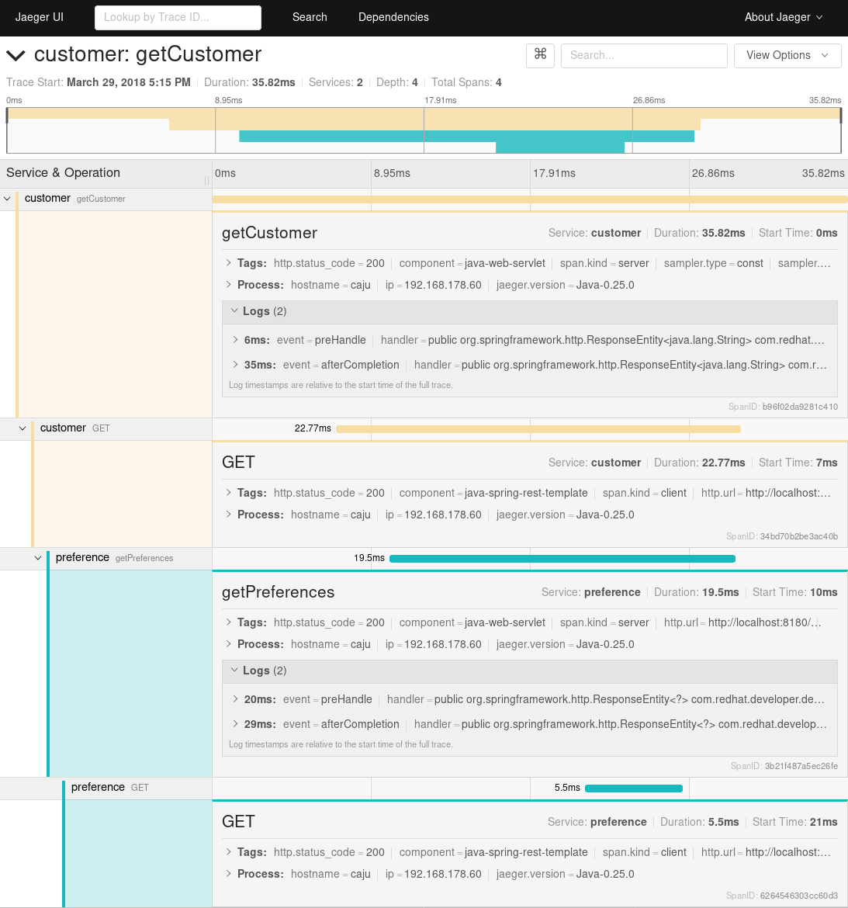

Customer
========

This is the customer microservice, part of the Istio Tutorial demo. Even though this microservice is meant to be executed within a Container on a Pod on Kubernetes/OpenShift, it can still be executed on bare metal.

This is a regular Spring Boot application, with OpenTracing and Jaeger dependencies to provide distributed tracing capabilities.

Running on the local machine
============================

To run this service for development purposes on your own machine, execute:

```bash
JAEGER_SERVICE_NAME=customer mvn \
  spring-boot:run \
  -Drun.arguments="--spring.config.location=src/main/resources/application-local.properties"
```

The `application-local.properties` contains sensible values for a setup where all services are running locally. It assumes that the `preferences` service is running on the port `8180`. If that's not the case, adjust the property file accordingly.

The environment variable `JAEGER_SERVICE_NAME` is required, as the Jaeger Tracer is embedded into our application and expects a service name to be specified. The example should work, however, even when an installation of Jaeger is *not* available.

If you do prefer to have a local Jaeger instance running to see the traces, the easiest is to start via a Docker
container:

```bash
docker run \
  --rm \
  -p5775:5775/udp \
  -p6831:6831/udp \
  -p6832:6832/udp \
  -p16686:16686 \
  -p14268:14268 \
  jaegertracing/all-in-one:1.3
```

The default configuration for the Jaeger tracer samples only a small portion of the requests. To trace every incoming request and report the spans to the log file, export the following environment variables and start the application again:

```bash
export JAEGER_REPORTER_LOG_SPANS=true
export JAEGER_SAMPLER_TYPE=const
export JAEGER_SAMPLER_PARAM=1
```

To test, call http://localhost:8280/

```
$ curl http://localhost:8280/
customer => preference => recommendation v1 from 'caju': 3
```



Running on OpenShift
====================

The following commands will build a Docker image containing the application, create a Kubernetes `Deployment` and a corresponding `Service`, so that other services can discover the pods via the service name.

```bash
mvn clean package
docker build -t example/customer .
docker images | grep customer
oc apply -f ../../kubernetes/Deployment.yml
oc apply -f ../../kubernetes/Service.yml
oc expose service customer
```

The last command will expose the service to the outside world, allowing you to make an HTTP call directly from your host machine:

```
curl http://customer-tutorial.127.0.0.1.nip.io/
```
