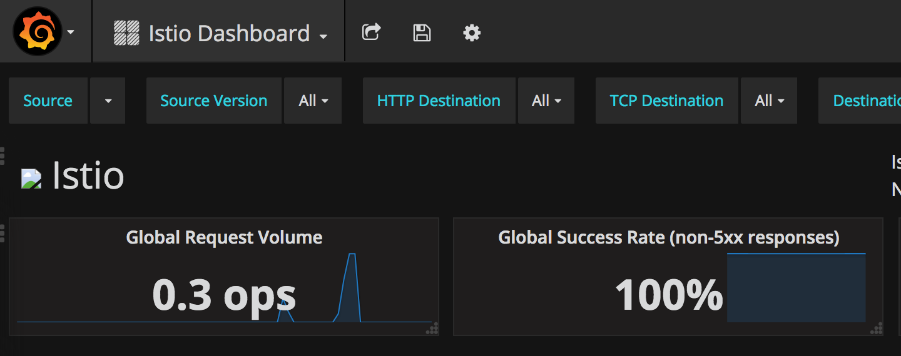
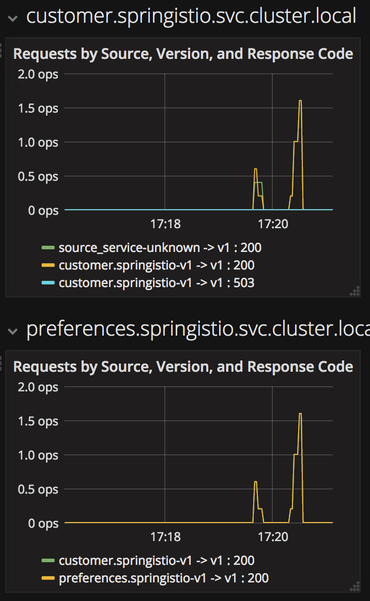

# Java (Spring Boot) + Istio on Kubernetes/OpenShift

There are three different and super simple microservices in this system and they are chained together in the following sequence:

customer -> preference -> recommendation

For now, they have a simple exception handling solution for dealing with
a missing dependent service, it just returns the error message to the end-user.

There are two more simple apps that illustrate how Istio handles egress routes: egressgithub and egresshttpbin

**Table of Contents**

<!-- toc -->

* [Prerequisite CLI tools](#prerequisite-cli-tools)
* [Setup minishift](#setup-minishift)
* [Setup environment](#setup-environment)
* [Istio installation script](#istio-installation-script)
* [Deploy customer](#deploy-customer)
* [Deploy preference](#deploy-preference)
* [Deploy recommendation](#deploy-recommendation)
* [Updating & redeploying code](#updating-redeploying-code)
* [Tracing](#tracing)
* [Monitoring](#monitoring)
* [Istio RouteRule Changes](#istio-routerule-changes)
  * [recommendation:v2](#recommendationv2)
* [Changing Istio RouteRules](#changing-istio-routerules)
    * [All users to recommendation:v2](#all-users-to-recommendationv2)
    * [All users to recommendation:v1](#all-users-to-recommendationv1)
    * [All users to recommendation v1 and v2](#all-users-to-recommendation-v1-and-v2)
    * [Split traffic between v1 and v2](#split-traffic-between-v1-and-v2)
* [Fault Injection](#fault-injection)
  * [HTTP Error 503](#http-error-503)
  * [Delay](#delay)
* [Retry](#retry)
* [Timeout](#timeout)
* [Smart routing based on user-agent header (Canary Deployment)](#smart-routing-based-on-user-agent-header-canary-deployment)
    * [Set recommendation to all v1](#set-recommendation-to-all-v1)
    * [Set Safari users to v2](#set-safari-users-to-v2)
    * [Set mobile users to v2](#set-mobile-users-to-v2)
    * [Clean up](#clean-up)
* [Mirroring Traffic (Dark Launch)](#mirroring-traffic-dark-launch)
* [Access Control](#access-control)
    * [Whitelist](#whitelist)
    * [Blacklist](#blacklist)
* [Load Balancer](#load-balancer)
* [Circuit Breaker](#circuit-breaker)
    * [Fail Fast with Max Connections & Max Pending Requests](#fail-fast-with-max-connections-max-pending-requests)
    * [Pool Ejection](#pool-ejection)
* [Egress](#egress)
    * [Create HTTPBin Java App](#create-httpbin-java-app)
    * [Create the Github Java App](#create-the-github-java-app)
    * [Istio-ize Egress](#istio-ize-egress)
* [Rate Limiting](#rate-limiting)
* [Tips & Tricks](#tips-tricks)

<!-- toc stop -->

## Prerequisite CLI tools
You will need in this tutorial
* minishift (https://github.com/minishift/minishift/releases)
* docker (https://www.docker.com/docker-mac)
* kubectl (https://kubernetes.io/docs/tasks/tools/install-kubectl/#install-kubectl-binary-via-curl)
* oc (eval $(minishift oc-env))
* mvn (https://archive.apache.org/dist/maven/maven-3/3.3.9/binaries/apache-maven-3.3.9-bin.tar.gz)
* stern (brew install stern)
* istioctl (will be installed via the steps below)
* curl, gunzip, tar are built-in to MacOS or part of your bash shell
* git (everybody needs the git CLI)

## Setup minishift
Assumes minishift, tested with minshift v1.10.0+10461c6

Minishift creation script
```bash
#!/bin/bash

# add the location of minishift execuatable to PATH
# I also keep other handy tools like kubectl and kubetail.sh
# in that directory

export MINISHIFT_HOME=~/minishift_1.10.0
export PATH=$MINISHIFT_HOME:$PATH

minishift profile set tutorial
minishift config set memory 8GB
minishift config set cpus 3
minishift config set vm-driver virtualbox
minishift config set image-caching true
minishift addon enable admin-user
minishift config set openshift-version v3.7.0

minishift start
```

## Setup environment

```bash
eval $(minishift oc-env)
eval $(minishift docker-env)
oc login $(minishift ip):8443 -u admin -p admin
```

Note: In this tutorial, you will often be polling the customer endpoint with curl, while simultaneously viewing logs via stern or kubetail.sh and issuing commands via oc and istioctl.  Consider using three terminal windows.

## Istio installation script

```bash
#!/bin/bash
curl -L https://github.com/istio/istio/releases/download/0.4.0/istio-0.4.0-osx.tar.gz | tar xz
cd istio-0.4.0
```

```bash
oc login $(minishift ip):8443 -u admin -p admin
oc adm policy add-scc-to-user anyuid -z istio-ingress-service-account -n istio-system
oc adm policy add-scc-to-user anyuid -z istio-egress-service-account -n istio-system
oc adm policy add-scc-to-user anyuid -z default -n istio-system
oc create -f install/kubernetes/istio.yaml
oc project istio-system
oc expose svc istio-ingress
oc apply -f install/kubernetes/addons/prometheus.yaml
oc apply -f install/kubernetes/addons/grafana.yaml
oc apply -f install/kubernetes/addons/servicegraph.yaml
oc expose svc servicegraph
oc expose svc grafana
oc expose svc prometheus
oc process -f https://raw.githubusercontent.com/jaegertracing/jaeger-openshift/master/all-in-one/jaeger-all-in-one-template.yml | oc create -f -
```

Wait for Istio's components to be ready

```bash
oc get pods
NAME                             READY     STATUS    RESTARTS   AGE
grafana-3617079618-4qs2b         1/1       Running   0          4m
istio-ca-1363003450-tfnjp        1/1       Running   0          4m
istio-ingress-1005666339-vrjln   1/1       Running   0          4m
istio-mixer-465004155-zn78n      3/3       Running   0          5m
istio-pilot-1861292947-25hnm     2/2       Running   0          4m
jaeger-210917857-2w24f           1/1       Running   0          4m
prometheus-168775884-dr5dm       1/1       Running   0          4m
servicegraph-1100735962-tdh78    1/1       Running   0          4m
```

And if you need quick access to the OpenShift console

```bash
minishift console
```

Note: on your first launch of the OpenShift console via minishift, you will like receive a warning with
"Your connection is not private", it depends on your browser type and settings.  Simply select "Proceed to 192.168.99.100 (unsafe)" to bypass the warning.

For minishift, with the admin-user addon, the user is "admin" and the password is "admin"

## Deploy customer

Make sure you have are logged in

```bash
oc whoami
```

and you have setup the project/namespace

```bash
oc new-project tutorial
oc adm policy add-scc-to-user privileged -z default -n tutorial
```

Then clone the git repository

```bash
git clone https://github.com/redhat-developer-demos/istio-tutorial
cd istio-tutorial
```

 Start deploying the microservice projects, starting with customer

```bash
cd customer

mvn clean package

docker build -t example/customer .

docker images | grep customer
```

Note: Your very first docker build will take a bit of time as it downloads all the layers.  Subsequent rebuilds of the docker image, updating only the jar/app layer will be very fast.

Add *istioctl* to your $PATH, you downloaded it a few steps back.  An example

```bash
export ISTIO_HOME=~/istio-0.4.0
export PATH=$ISTIO_HOME/bin:$PATH

istioctl version

Version: 0.4.0
GitRevision: 24089ea97c8d244493c93b499a666ddf4010b547-dirty
GitBranch: 6401744b90b43901b2aa4a8bced33c7bd54ffc13
User: root@cc5c34bbd1ee
GolangVersion: go1.8
```

Now let's deploy the customer pod with its sidecar

```bash
oc apply -f <(istioctl kube-inject -f src/main/kubernetes/Deployment.yml) -n tutorial

oc create -f src/main/kubernetes/Service.yml -n tutorial
```

Since customer is the forward most microservice (customer -> preference -> recommendation), let's add an OpenShift Route that exposes that endpoint.

```bash
oc expose service customer

oc get route

oc get pods -w
```

Waiting for Ready 2/2, to break out of the waiting use "ctrl-c"

Then test the customer endpoint

```bash
curl customer-tutorial.$(minishift ip).nip.io
```

You should see the following error because preference and recommendation are not yet deployed.

```bash
customer => java.net.UnknownHostException: preference
```

Also review the logs

```bash
stern customer -c customer
```

You should see a stacktrace containing this cause:

```bash
org.springframework.web.client.ResourceAccessException: I/O error on GET request for "http://preference:8080": preference; nested exception is java.net.UnknownHostException: preference
```

Back to the main istio-tutorial directory

```bash
cd ..
```

## Deploy preference

```bash
cd preference

mvn clean package

docker build -t example/preference .

docker images | grep preference

oc apply -f <(istioctl kube-inject -f src/main/kubernetes/Deployment.yml) -n tutorial

oc create -f src/main/kubernetes/Service.yml

oc get pods -w
```

Wait for the Ready 2/2

```bash
curl customer-tutorial.$(minishift ip).nip.io
```

It will respond with an error since recommendation is not yet deployed. 
Note: We could make this a bit more resilent in a future iteration of this tutorial

```bash
customer => preference => java.net.UnknownHostException: recommendation
```

and check out the logs 

```bash
stern preference -c preference
```

You should see a stacktrace containing this cause:

```bash
org.springframework.web.client.ResourceAccessException: I/O error on GET request for "http://recommendation:8080": recommendation; nested exception is java.net.UnknownHostException: recommendation
```

Back to the main istio-tutorial directory

```bash
cd ..
```

## Deploy recommendation

Note: The tag "v1" at the end of the image name is important.  We will be creating a v2 version of recommendation later in this tutorial.   Having both a v1 and v2 version of the recommendation code will allow us to exercise some interesting aspects of Istio's capabilities.

```bash
cd recommendation

mvn clean package

docker build -t example/recommendation:v1 .

docker images | grep recommendation

oc apply -f <(istioctl kube-inject -f src/main/kubernetes/Deployment.yml) -n tutorial

oc create -f src/main/kubernetes/Service.yml

oc get pods -w

curl customer-tutorial.$(minishift ip).nip.io
```

it returns

```bash
customer => preference => recommendation v1 from '99634814-sf4cl': 1
```

and you can monitor the recommendation logs with

```bash
stern recommendation -c recommendation
```

Back to the main istio-tutorial directory

```bash
cd ..
```

## Updating & redeploying code

When you wish to change code (e.g. editing the .java files) and wish to "redeploy", simply:

```bash
cd {servicename}

vi src/main/java/com/redhat/developer/demos/{servicename}/{Servicename}Controller.java
```

Make your edits and esc-w-q

```bash
mvn clean package
docker build -t example/{servicename} .

oc get pods -o jsonpath='{.items[*].metadata.name}' -l app={servicename}
oc get pods -o jsonpath='{.items[*].metadata.name}' -l app={servicename},version=v1

oc delete pod -l app={servicename},version=v1
```

Why the delete pod?

Based on the Deployment configuration, Kubernetes/OpenShift will recreate the pod, based on the new docker image as it attempts to keep the desired replicas available

```bash
oc describe deployment {servicename} | grep Replicas
```

## Monitoring

Out of the box, you get monitoring via Prometheus and Grafana.  

```bash
minishift openshift service grafana --in-browser
```

Make sure to select "Istio Dashboard" in the Grafana Dashboard



Scroll-down to see the stats for customer, preference and recommendation



## Custom Metrics

Istio also allows you to specify custom metrics which can be seen inside of the Prometheus dashboard

```bash
minishift openshift service prometheus --in-browser
```

Add the custom metric and rule.  First make sure you are in the "istio-tutorial" directory and then

```bash
oc apply -f istiofiles/recommendation_requestcount.yml -n istio-system
```

In the Prometheus dashboard, add the following

```bash
round(increase(istio_recommendation_request_count{destination="recommendation.tutorial.svc.cluster.local" }[60m]))
```

and select Execute


Then run several requests through the system

```bash
curl customer-tutorial.$(minishift ip).nip.io
```

Note: you may have to refresh the browser for the Prometheus graph to update. And you may wish to make the interval 5m (5 minutes) as seen in the screenshot above.

## Tracing

Tracing requires a bit of work on the Java side.  Each microservice needs to pass on the headers which are used to enable the traces.

https://github.com/redhat-developer-demos/istio-tutorial/blob/master/customer/src/main/java/com/redhat/developer/demos/customer/tracing/HttpHeaderForwarderHandlerInterceptor.java

and

https://github.com/redhat-developer-demos/istio-tutorial/blob/master/customer/src/main/java/com/redhat/developer/demos/customer/CustomerApplication.java#L21-L31

To open the Jaeger console, select customer from the list of services and Find Traces

```bash
minishift openshift service jaeger-query --in-browser
```


## Istio RouteRule Changes

### recommendation:v2

We can experiment with Istio routing rules by making a change to RecommendationsController.java like the following and creating a "v2" docker image.

```java
    private static final String RESPONSE_STRING_FORMAT = "recommendation v2 from '%s': %d\n";
```

The "v2" tag during the docker build is significant.

There is also a 2nd deployment.yml file to label things correctly

```bash
cd recommendation

mvn clean package

docker build -t example/recommendation:v2 .

docker images | grep recommendation
example/recommendation                  v2                  c31e399a9628        5 seconds ago       438MB
example/recommendation                  v1              f072978d9cf6        8 minutes ago      438MB
```

*Important:* back up one directory before applying the deployment yaml.  We have a 2nd Deployment to manage the v2 version of recommendation.  

```bash
cd ..

oc apply -f <(istioctl kube-inject -f kubernetesfiles/recommendation_v2_deployment.yml) -n tutorial

oc get pods -w
```

Wait for those pods to show "2/2", the istio-proxy/envoy sidecar is part of that pod

```bash
NAME                                  READY     STATUS    RESTARTS   AGE
customer-3600192384-fpljb             2/2       Running   0          17m
preference-243057078-8c5hz           2/2       Running   0          15m
recommendation-v1-60483540-9snd9     2/2       Running   0          12m
recommendation-v2-2815683430-vpx4p   2/2       Running   0         15s
```

and test the customer endpoint

```bash
curl customer-tutorial.$(minishift ip).nip.io
```

you likely see "customer => preference => recommendation v1 from '99634814-d2z2t': 3", where '99634814-d2z2t' is the pod running v1 and the 3 is basically the number of times you hit the endpoint.

```
curl customer-tutorial.$(minishift ip).nip.io
```

you likely see "customer => preference => recommendation v2 from '2819441432-5v22s': 1" as by default you get round-robin load-balancing when there is more than one Pod behind a Service

Send several requests to see their responses

```bash
#!/bin/bash
while true
do curl customer-tutorial.$(minishift ip).nip.io
sleep .1
done
```

The default Kubernetes/OpenShift behavior is to round-robin load-balance across all available pods behind a single Service.  Add another replica of recommendation-v2 Deployment.

```bash
oc scale --replicas=2 deployment/recommendation-v2
```

Now, you will see two requests into the v2 and one for v1.

```bash
customer => preference => recommendation v1 from '2819441432-qsp25': 29
customer => preference => recommendation v2 from '99634814-sf4cl': 37
customer => preference => recommendation v2 from '99634814-sf4cl': 38
```

Scale back to a single replica of the recommendation-v2 Deployment

```bash
oc scale --replicas=1 deployment/recommendation-v2
```

and back to the main directory

```bash
cd ..
```

## Changing Istio RouteRules

#### All users to recommendation:v2

From the main istio-tutorial directory,

```bash
oc create -f istiofiles/route-rule-recommendation-v2.yml -n tutorial

curl customer-tutorial.$(minishift ip).nip.io
```

you should only see v2 being returned

#### All users to recommendation:v1

Note: "replace" instead of "create" since we are overlaying the previous rule

```bash
oc replace -f istiofiles/route-rule-recommendation-v1.yml -n tutorial

oc get routerules -n tutorial

oc get routerules/recommendation-default -o yaml -n tutorial
```

#### All users to recommendation v1 and v2

By simply removing the rule

```bash
oc delete routerules/recommendation-default -n tutorial
```

and you should see the default behavior of load-balancing between v1 and v2

```bash
curl customer-tutorial.$(minishift ip).nip.io
```

#### Split traffic between v1 and v2

Canary Deployment scenario: push v2 into the cluster but slowly send end-user traffic to it, if you continue to see success, continue shifting more traffic over time

```bash
oc get pods -l app=recommendation -n tutorial
NAME                                  READY     STATUS    RESTARTS   AGE
recommendation-v1-3719512284-7mlzw   2/2       Running   6          2h
recommendation-v2-2815683430-vn77w   2/2       Running   0          1h
```

Create the routerule that will send 90% of requests to v1 and 10% to v2

```bash
oc create -f istiofiles/route-rule-recommendation-v1_and_v2.yml -n tutorial
```

and send in several requests

```bash
#!/bin/bash
while true
do curl customer-tutorial.$(minishift ip).nip.io
sleep .1
done
```

In another terminal, change the mixture to be 75/25

```bash
oc replace -f istiofiles/route-rule-recommendation-v1_and_v2_75_25.yml -n tutorial
```

Clean up

```bash
oc delete routerule recommendation-v1-v2 -n tutorial
```

## Fault Injection

Apply some chaos engineering by throwing in some HTTP errors or network delays.  Understanding failure scenarios is a critical aspect of microservices architecture  (aka distributed computing)

### HTTP Error 503

By default, recommendation v1 and v2 are being randomly load-balanced as that is the default behavior in Kubernetes/OpenShift

```bash
oc get pods -l app=recommendation -n tutorial
NAME                                  READY     STATUS    RESTARTS   AGE
recommendation-v1-3719512284-7mlzw   2/2       Running   6          18h
recommendation-v2-2815683430-vn77w   2/2       Running   0          3h
```

You can inject 503's, for approximately 50% of the requests

```bash
oc create -f istiofiles/route-rule-recommendation-503.yml -n tutorial

curl customer-tutorial.$(minishift ip).nip.io
customer => preference => recommendation v1 from '99634814-sf4cl': 88
curl customer-tutorial.$(minishift ip).nip.io
customer => 503 preference => 503 fault filter abort
curl customer-tutorial.$(minishift ip).nip.io
customer => preference => recommendation v2 from '2819441432-qsp25': 51
```

Clean up

```bash
oc delete routerule recommendation-503 -n tutorial
```

### Delay

The most insidious of possible distributed computing faults is not a "down" service but a service that is responding slowly, potentially causing a cascading failure in your network of services.

```bash
oc create -f istiofiles/route-rule-recommendation-delay.yml -n tutorial
```

And hit the customer endpoint

```bash
#!/bin/bash
while true
do
time curl customer-tutorial.$(minishift ip).nip.io
sleep .1
done
```

You will notice many requets to the customer endpoint now have a delay.
If you are monitoring the logs for recommendation v1 and v2, you will also see the delay happens BEFORE the recommendation service is actually called

```bash
stern recommendation -n tutorial
```
or
```bash
./kubetail.sh recommendation -n tutorial
```

Clean up

```
oc delete routerule recommendation-delay -n tutorial
```

## Retry

Instead of failing immediately, retry the Service N more times

We will use Istio and return 503's about 50% of the time.  Send all users to v2 which will throw out some 503's

```bash
oc create -f istiofiles/route-rule-recommendation-v2_503.yml -n tutorial
```

Now, if you hit the customer endpoint several times, you should see some 503's

```bash
curl customer-tutorial.$(minishift ip).nip.io
customer => 503 preference => 503 fault filter abort
```

Now add the retry rule

```bash
oc create -f istiofiles/route-rule-recommendation-v2_retry.yml -n tutorial
```

and after a few seconds, things will settle down and you will see it work every time

```bash
curl customer-tutorial.$(minishift ip).nip.io

customer => preference => recommendation v2 from '2819441432-qsp25': 56
```

You can see the active RouteRules via

```bash
oc get routerules -n tutorial
```

Now, delete the retry rule and see the old behavior, some random 503s

```bash
oc delete routerule recommendation-v2-retry -n tutorial

curl customer-tutorial.$(minishift ip).nip.io
```

Now, delete the 503 rule and back to random load-balancing between v1 and v2

```bash
oc delete routerule recommendation-v2-503 -n tutorial

curl customer-tutorial.$(minishift ip).nip.io
```

## Timeout

Wait only N seconds before giving up and failing.  At this point, no other route rules should be in effect.  oc get routerules and oc delete routerule rulename if there are some.

First, introduce some wait time in recommendation v2 by uncommenting the line that call the timeout method. Update RecommendationsController.java making it a slow perfomer

```java
    @RequestMapping("/")
    public ResponseEntity<String> getRecommendations() {
        count++;
        logger.debug(String.format("recommendation request from %s: %d", HOSTNAME, count));

        timeout();

        logger.debug("recommendation service ready to return");
        if (misbehave) {
            return doMisbehavior();
        }
        return ResponseEntity.ok(String.format(RecommendationController.RESPONSE_STRING_FORMAT, HOSTNAME, count));
    }
```

Rebuild and redeploy

```bash
cd recommendation

mvn clean package

docker build -t example/recommendation:v2 .

docker images | grep recommendation

oc delete pod -l app=recommendation,version=v2 -n tutorial

cd ..
```

Hit the customer endpoint a few times, to see the load-balancing between v1 and v2 but with v2 taking a bit of time to respond

```bash
#!/bin/bash
while true
do
time curl customer-tutorial.$(minishift ip).nip.io
sleep .1
done
``` 

Then add the timeout rule

```bash
oc create -f istiofiles/route-rule-recommendation-timeout.yml -n tutorial

time curl customer-tutorial.$(minishift ip).nip.io
```

You will see it return v1 OR "upstream request timeout" after waiting about 1 second

```bash
time curl customer-tutorial.$(minishift ip).nip.io
customer => preference => recommendation v1 from '99634814-sf4cl': 133
time curl customer-tutorial.$(minishift ip).nip.io
customer => 503 preference => 504 upstream request timeout
```

Clean up, delete the timeout rule

```bash
oc delete routerule recommendation-timeout -n tutorial
```

## Smart routing based on user-agent header (Canary Deployment)

What is your user-agent?

https://www.whoishostingthis.com/tools/user-agent/

Note: the "user-agent" header being forwarded in the Customer and Preferences controllers in order for route rule modications around recommendation

#### Set recommendation to all v1

```bash
oc create -f istiofiles/route-rule-recommendation-v1.yml -n tutorial
```

#### Set Safari users to v2

```bash
oc create -f istiofiles/route-rule-safari-recommendation-v2.yml -n tutorial

oc get routerules -n tutorial
```

and test with a Safari (or even Chrome on Mac since it includes Safari in the string).  Safari only sees v2 responses from recommendation

and test with a Firefox browser, it should only see v1 responses from recommendation.

There are two ways to get the URL for your browser:

```bash
minishift openshift service customer --in-browser
```

That will open the openshift service `customer` in browser

Or

if you need just the url alone:

```bash
minishift openshift service customer --url
http://customer-tutorial.192.168.99.102.nip.io
```

You can also attempt to use the curl -A command to test with different user-agent strings.  

```bash
curl -A Safari customer-tutorial.$(minishift ip).nip.io
curl -A Firefox customer-tutorial.$(minishift ip).nip.io
```

You can describe the routerule to see its configuration

```bash
oc describe routerule recommendation-safari -n tutorial
```

Remove the Safari rule

```bash
oc delete routerule recommendation-safari -n tutorial
```

#### Set mobile users to v2

```bash
oc create -f istiofiles/route-rule-mobile-recommendation-v2.yml -n tutorial

curl -A "Mozilla/5.0 (iPhone; U; CPU iPhone OS 4(KHTML, like Gecko) Version/5.0.2 Mobile/8J2 Safari/6533.18.5" curl -A Safari customer-tutorial.$(minishift ip).nip.io
```

#### Clean up

```bash
oc delete routerule recommendation-mobile -n tutorial
```

## Mirroring Traffic (Dark Launch)

Wiretap, eavesdropping
Note: does not seem to work in 0.4.0

```bash
oc get pods -l app=recommendation -n tutorial
```

You should have 2 pods for recommendation based on the steps above

```bash
oc get routerules -n tutorial
```

You should have NO routerules
if so "oc delete routerule rulename -n tutorial"

Make sure you are in the main directory of "istio-tutorial"

```bash
oc create -f istiofiles/route-rule-recommendation-v1-mirror-v2.yml -n tutorial

curl customer-tutorial.$(minishift ip).nip.io
```

## Access Control

#### Whitelist

We'll create a whitelist on the preference service to only allow requests from the recommendation service, which will make the preference service invisible to the customer service. Requests from the customer service to the preference service will return a 404 Not Found HTTP error code.

```bash
istioctl create -f istiofiles/acl-whitelist.yml -n tutorial
```

```bash
curl customer-tutorial.$(minishift ip).nip.io
customer => 404 NOT_FOUND:preferencewhitelist.listchecker.tutorial:customer is not whitelisted
```

##### To reset the environment:

```bash
istioctl delete -f istiofiles/acl-whitelist.yml -n tutorial
```

#### Blacklist

We'll create a blacklist making the customer service blacklist to the preference service. Requests from the customer service to the preference service will return a 403 Forbidden HTTP error code.

```bash
istioctl create -f istiofiles/acl-blacklist.yml -n tutorial
```

```bash
curl customer-tutorial.$(minishift ip).nip.io
customer => 403 PERMISSION_DENIED:denycustomerhandler.denier.tutorial:Not allowed
```

##### To reset the environment:

```bash
istioctl delete -f istiofiles/acl-blacklist.yml -n tutorial
```


## Load Balancer

By default, you will see "round-robin" style load-balancing, but you can change it up, with the RANDOM option being fairly visible to the naked eye.

Add another v2 pod to the mix

```bash
oc scale deployment recommendation-v2 --replicas=2 -n tutorial
```

Wait a bit (oc get pods -w to watch)
and curl the customer endpoint many times

```bash
curl customer-tutorial.$(minishift ip).nip.io
```

Add a 3rd v2 pod to the mix

```bash
oc scale deployment recommendation-v2 --replicas=3 -n tutorial

oc get pods -n tutorial
NAME                                  READY     STATUS    RESTARTS   AGE
customer-1755156816-cjd2z             2/2       Running   0          1h
preference-3336288630-2cc6f          2/2       Running   0          1h
recommendation-v1-3719512284-bn42p   2/2       Running   0          59m
recommendation-v2-2815683430-97nnf   2/2       Running   0          43m
recommendation-v2-2815683430-d49n6   2/2       Running   0          51m
recommendation-v2-2815683430-tptf2   2/2       Running   0          33m
```

Wait for those 2/2 (two containers in each pod) and then poll the customer endpoint

```bash
#!/bin/bash
while true
do curl customer-tutorial.$(minishift ip).nip.io
sleep .1
done
```

The results should follow a fairly normal round-robin distribution pattern

```bash
customer => preference => recommendation v1 from '99634814-d2z2t': 1145
customer => preference => recommendation v2 from '2819441432-525lh': 1
customer => preference => recommendation v2 from '2819441432-rg45q': 2
customer => preference => recommendation v2 from '2819441432-bs5ck': 181
customer => preference => recommendation v1 from '99634814-d2z2t': 1146
customer => preference => recommendation v2 from '2819441432-rg45q': 3
customer => preference => recommendation v2 from '2819441432-rg45q': 4
customer => preference => recommendation v2 from '2819441432-bs5ck': 182
```

Now, add the Random LB DestinationPolicy

```bash
oc create -f istiofiles/recommendation_lb_policy_app.yml -n tutorial
```

And you should see a different pattern of which pod is being selected

```bash
customer => preference => recommendation v2 from '2819441432-rg45q': 10
customer => preference => recommendation v2 from '2819441432-525lh': 3
customer => preference => recommendation v2 from '2819441432-rg45q': 11
customer => preference => recommendation v1 from '99634814-d2z2t': 1153
customer => preference => recommendation v1 from '99634814-d2z2t': 1154
customer => preference => recommendation v1 from '99634814-d2z2t': 1155
customer => preference => recommendation v2 from '2819441432-rg45q': 12
customer => preference => recommendation v2 from '2819441432-525lh': 4
customer => preference => recommendation v2 from '2819441432-525lh': 5
customer => preference => recommendation v2 from '2819441432-rg45q': 13
customer => preference => recommendation v2 from '2819441432-rg45q': 14
```

Clean up

```bash
oc delete -f istiofiles/recommendation_lb_policy_app.yml -n tutorial

oc scale deployment recommendation-v2 --replicas=1 -n tutorial
```

## Circuit Breaker

#### Fail Fast with Max Connections & Max Pending Requests

First, you need to insure you have a routerule in place.  Let's use a 50/50 split of traffic which is more like the default behavior of Kubernetes.  

```bash
oc create -f istiofiles/route-rule-recommendation-v1_and_v2_50_50.yml -n tutorial
```

and if you polling the endpoint repeatedly, you will see the Istio behavior:

```bash
#!/bin/bash
while true
do curl customer-tutorial.$(minishift ip).nip.io
sleep .5
done
```

Output

```
customer => preference => recommendation v2 from '2819441432-bs5ck': 215
customer => preference => recommendation v2 from '2819441432-bs5ck': 216
customer => preference => recommendation v2 from '2819441432-bs5ck': 217
customer => preference => recommendation v1 from '99634814-d2z2t': 1184
customer => preference => recommendation v2 from '2819441432-bs5ck': 218
customer => preference => recommendation v1 from '99634814-d2z2t': 1185
customer => preference => recommendation v2 from '2819441432-bs5ck': 219
customer => preference => recommendation v1 from '99634814-d2z2t': 1186
customer => preference => recommendation v2 from '2819441432-bs5ck': 220
customer => preference => recommendation v1 from '99634814-d2z2t': 1187
customer => preference => recommendation v2 from '2819441432-bs5ck': 221
customer => preference => recommendation v1 from '99634814-d2z2t': 1188
customer => preference => recommendation v2 from '2819441432-bs5ck': 222
customer => preference => recommendation v2 from '2819441432-bs5ck': 223
customer => preference => recommendation v2 from '2819441432-bs5ck': 224
customer => preference => recommendation v2 from '2819441432-bs5ck': 225
```

With vanilla Kubernetes/OpenShift, the distrubtion of load is more round robin, while with Istio it is 50/50 but more random.

Next, update RecommendationsController.java by uncommenting the line that call the timeout method, and changing the flag `misbehave` to `true`. These modifications will make it a slow perfomer and throw somes 503s.

```java
    /**
     * Flag for throwing a 503 when enabled
     */
    private boolean misbehave = true;
    
    // ...

    @RequestMapping("/")
    public ResponseEntity<String> getRecommendations() {
        count++;
        logger.debug(String.format("Big Red Dog v1 %s %d", HOSTNAME, count));

        timeout();

        logger.debug("recommendations ready to return");
        if (misbehave) {
            return doMisbehavior();
        }
        return ResponseEntity.ok(String.format("Clifford v1 %s %d", HOSTNAME, count));
    }
```

Rebuild, redeploy

```
cd recommendation
mvn clean package
docker build -t example/recommendation:v2 .
docker images | grep recommendation
oc delete pod -l app=recommendation,version=v2 -n tutorial
```

The deletion of the previously running pod will cause Kubernetes/OpenShift to restart it based on the new docker image.

Back to the main directory

```bash
cd ..
```

and test the customer endpoint

```bash
#!/bin/bash
while true
do curl customer-tutorial.$(minishift ip).nip.io
sleep .5
done
```

Whenever you are hitting v2, you will notice the slowness in the response based on the Thread.sleep(3000)

Watch the logging output of recommendation

```bash
Terminal 1:
./kubetail.sh recommendation -n tutorial
or
brew install stern
stern recommendation -c recommendation -n tutorial

Terminal 2:
curl customer-tutorial.$(minishift ip).nip.io
```

Now add the circuit breaker.

```bash
istioctl create -f istiofiles/recommendation_cb_policy_version_v2.yml -n tutorial

istioctl get destinationpolicies -n tutorial
```

More information on the fields for the simple circuit-breaker
https://istio.io/docs/reference/config/traffic-rules/destination-policies.html#simplecircuitbreakerpolicy

then 

```bash
cd gatling_test
mvn clean integration-test -Dusers=2 -Dendpoint.url=http://customer-tutorial.$(minishift ip).nip.io
```

and open the generated report.  

```bash
find target -name index.html | xargs open
```

When using 2 concurrent users, all requests are likely to succeed, there are in fact 2 pods of recommendation available. But build reports a failure as we had set the reponse time to be less than 3 seconds

```bash
mvn clean integration-test -Dendpoint.url=http://customer-tutorial.$(minishift ip).nip.io
```

It will still likely succeed, as by default the number of concurrent users is 5

At this point, that is enough load to have tripped the circuit-breaker and you should see some failures in the report.

If you wish to peer inside the CB

```bash
istioctl get destinationpolicies recommendation-circuitbreaker -o yaml -n tutorial
```

Now, delete the Destination Policy 

```bash
istioctl delete destinationpolicy recommendation-circuitbreaker -n tutorial
```

and re-run the load test

```bash
mvn clean integration-test -Dendpoint.url=http://customer-tutorial.$(minishift ip).nip.io
```

Now, even with a load of 5 where there are only two pods, you should see all requests succeed as there is no circuit-breaker in the middle, tripping/opening, but you will notice maven build reporting failure because of the SLA in reponse time which is set at 3 seconds

Clean up

```bash
oc delete routerule recommendation-v1-v2 -n tutorial
```

#### Pool Ejection

There is a 2nd circuit-breaker policy yaml file. In this case, we are attempting load-balancing pool ejection.  We want the slow and misbehaving instance of recommendation v2 to be kicked out and more requests to be handled by v1.  Envoy refers to this as "outlier detection".

Throw some requests at the customer endpoint

```bash
#!/bin/bash
while true
do curl customer-tutorial.$(minishift ip).nip.io
sleep .1
done
```

By default, you will see load-balancing behind that URL, across the 2 pods that are currently in play. By default Kubernetes/OpenShift will alternative between v1 and v2

```bash
customer => preference => recommendation v1 from '99634814-d2z2t': 1809
customer => preference => recommendation v2 from '2819441432-bs5ck': 832
customer => preference => recommendation v1 from '99634814-d2z2t': 1810
customer => preference => recommendation v2 from '2819441432-bs5ck': 833
customer => preference => recommendation v1 from '99634814-d2z2t': 1811
customer => preference => recommendation v2 from '2819441432-bs5ck': 834
customer => preference => recommendation v1 from '99634814-d2z2t': 1812
customer => preference => recommendation v2 from '2819441432-bs5ck': 835
customer => preference => recommendation v1 from '99634814-d2z2t': 1813
customer => preference => recommendation v2 from '2819441432-bs5ck': 836
```

Add a 2nd pod to recommendation

```bash
oc scale deployment recommendation-v2 --replicas=2 -n tutorial

oc get pods

NAME                                  READY     STATUS    RESTARTS   AGE
customer-3600192384-fpljb             2/2       Running   0          2h
preference-243057078-8c5hz           2/2       Running   0          2h
recommendation-v1-60483540-2pt4z     2/2       Running   0          40m
recommendation-v2-2815683430-t7b9q   2/2       Running   0          21s
recommendation-v2-2815683430-xw7qg   2/2       Running   0          19m
```

and your pattern will change slightly to v1, v2, v2 then repeat

```bash
customer => preference => recommendation v1 from '99634814-d2z2t': 1830
customer => preference => recommendation v2 from '2819441432-f4ls5': 3
customer => preference => recommendation v2 from '2819441432-bs5ck': 854
customer => preference => recommendation v1 from '99634814-d2z2t': 1831
customer => preference => recommendation v2 from '2819441432-f4ls5': 4
customer => preference => recommendation v2 from '2819441432-bs5ck': 855
customer => preference => recommendation v1 from '99634814-d2z2t': 1832
customer => preference => recommendation v2 from '2819441432-f4ls5': 5
customer => preference => recommendation v2 from '2819441432-bs5ck': 856
```

In another Terminal, setup the Destination Policy

```bash
istioctl create -f istiofiles/recommendation_cb_policy_app.yml -n tutorial
```

You should see the Random load-balancing take effect

```bash
customer => preference => recommendation v1 from '99634814-d2z2t': 1837
customer => preference => recommendation v2 from '2819441432-f4ls5': 10
customer => preference => recommendation v2 from '2819441432-bs5ck': 861
customer => preference => recommendation v2 from '2819441432-f4ls5': 11
customer => preference => recommendation v1 from '99634814-d2z2t': 1838
customer => preference => recommendation v1 from '99634814-d2z2t': 1839
customer => preference => recommendation v1 from '99634814-d2z2t': 1840
customer => preference => recommendation v2 from '2819441432-bs5ck': 862
customer => preference => recommendation v2 from '2819441432-bs5ck': 863
customer => preference => recommendation v1 from '99634814-d2z2t': 1841
customer => preference => recommendation v2 from '2819441432-f4ls5': 12
customer => preference => recommendation v2 from '2819441432-f4ls5': 13
customer => preference => recommendation v2 from '2819441432-bs5ck': 864
```

Now, simply just delete a v2 pod as that will cause 5xx errors

```bash
oc delete pod recommendation-v2-2815683430-t7b9q
```

you should see a single 503 returned to the end-user

```bash
customer => preference => recommendation v2 from '2819441432-f4ls5': 22
customer => preference => recommendation v2 from '2819441432-f4ls5': 23
customer => 503 preference => 503 upstream connect error or disconnect/reset before headers
customer => preference => recommendation v1 from '99634814-d2z2t': 1845
customer => preference => recommendation v2 from '2819441432-f4ls5': 24
```

OR throw in some misbehavior by getting the pod identifiers

```bash
oc get pods
```

and then shelling into a v2 pod

```bash
oc exec -it recommendation-v2-2815683430-xw7qg -c recommendation /bin/bash
```

and then hit its misbehave endpoint to set the flag

```bash
curl localhost:8080/misbehave
```

At this point, you should get a 503 from the v2 pod that was flagged and 
you should see requests/traffic focusing on the "good" pods, until the sleepWindow expires.

```bash
customer => preference => recommendation v1 from '99634814-d2z2t': 1866
customer => preference => recommendation v2 from '2819441432-f4ls5': 41
customer => 503 preference => 503 recommendation misbehavior from '2819441432-55n9f'
customer => preference => recommendation v1 from '99634814-d2z2t': 1867
customer => preference => recommendation v2 from '2819441432-f4ls5': 42
```

If you wait long enough, you should see the v2 pod reenter the load-balancing pool 

Clean up

```bash
oc scale deployment recommendation-v2 --replicas=1 -n tutorial

istioctl delete destinationpolicies recommendation-poolejector -n tutorial
```

## Egress

There are two examples of egress routing, one for httpbin.org and one for github.  Egress routes allow you to apply rules to how internal services interact with external APIs/services.

Create a namespace/project to hold these egress examples

```bash
oc new-project istioegress
oc adm policy add-scc-to-user privileged -z default -n istioegress
```

#### Create HTTPBin Java App

```bash
cd egresshttpbin/

mvn spring-boot:run

curl localhost:8080

ctrl-c

mvn clean package

docker build -t example/egresshttpbin:v1 .

docker images | grep egress

docker run -it -p 8080:8080 --rm example/egresshttpbin:v1

curl $(minishift ip):8080

ctrl-c

docker ps | grep egress

docker ps -a | grep egress

oc apply -f src/main/kubernetes/Deployment.yml -n istioegress

oc create -f src/main/kubernetes/Service.yml

oc expose service egresshttpbin

curl egresshttpbin-istioegress.$(minishift ip).nip.io

```

Note: It does not work...yet, more to come.

Back to the main istio-tutorial directory

```bash
cd ..
```

#### Create the Github Java App

```bash
cd egressgithub/

mvn clean package

docker build -t example/egressgithub:v1 .

docker images | grep egress

docker run -it -p 8080:8080 --rm example/egressgithub:v1

curl $(minishift ip):8080
```

Note: it will not work now but it will once Istio-ized

```bash
ctrl-c

docker ps | grep egress

oc apply -f src/main/kubernetes/Deployment.yml -n istioegress

oc create -f src/main/kubernetes/Service.yml

oc expose service egressgithub

curl egressgithub-istioegress.$(minishift ip).nip.io

cd ..
```

#### Istio-ize Egress

```bash
istioctl create -f istiofiles/egress_httpbin.yml

istioctl get egressrules

curl egresshttpbin-istioegress.$(minishift ip).nip.io
```

or shell into the pod by getting its name and then using that name with oc exec

```bash
oc exec -it $(oc get pods -o jsonpath="{.items[*].metadata.name}" -l app=egresshttpbin,version=v1) /bin/bash

curl localhost:8080

curl httpbin.org/user-agent

curl httpbin.org/headers

exit
```

add a egressrule for google

```bash
cat <<EOF | istioctl create -f -
apiVersion: config.istio.io/v1alpha2
kind: EgressRule
metadata:
  name: google-egress-rule
spec:
  destination:
    service: www.google.com
  ports:
    - port: 443
      protocol: https
EOF
```

and shell into it for testing

```bash
oc exec -it $(oc get pods -o jsonpath="{.items[*].metadata.name}" -l app=egressgithub,version=v1) /bin/bash

curl http://www.google.com:443

exit
```

Now, execute the Java code that hits api.google.com/users

```bash
istioctl create -f istiofiles/egress_github.yml

curl egressgithub-istioegress.$(minishift ip).nip.io
```

## Rate Limiting

Here we will limit the number of concurrent requests into recommendation v2

Current view of the v2 RecommendationsController.java

```java
package com.redhat.developer.demos.recommendation;

import org.slf4j.Logger;
import org.slf4j.LoggerFactory;
import org.springframework.http.HttpStatus;
import org.springframework.http.ResponseEntity;
import org.springframework.web.bind.annotation.RequestMapping;
import org.springframework.web.bind.annotation.RestController;

@RestController
public class RecommendationController {

    private static final String RESPONSE_STRING_FORMAT = "recommendation v2 from '%s': %d\n";

    private final Logger logger = LoggerFactory.getLogger(getClass());

    /**
     * Counter to help us see the lifecycle
     */
    private int count = 0;

    /**
     * Flag for throwing a 503 when enabled
     */
    private boolean misbehave = false;

    private static final String HOSTNAME =
            parseContainerIdFromHostname(System.getenv().getOrDefault("HOSTNAME", "unknown"));

    static String parseContainerIdFromHostname(String hostname) {
        return hostname.replaceAll("recommendation-v\\d+-", "");
    }

    @RequestMapping("/")
    public ResponseEntity<String> getRecommendations() {
        count++;
        logger.debug(String.format("recommendation request from %s: %d", HOSTNAME, count));

        timeout();

        logger.debug("recommendation service ready to return");
        if (misbehave) {
            return doMisbehavior();
        }
        return ResponseEntity.ok(String.format(RecommendationController.RESPONSE_STRING_FORMAT, HOSTNAME, count));
    }

    private void timeout() {
        try {
            Thread.sleep(3000);
        } catch (InterruptedException e) {
            logger.info("Thread interrupted");
        }
    }

    private ResponseEntity<String> doMisbehavior() {
        count = 0;
        misbehave = false;
        logger.debug(String.format("Misbehaving %d", count));
        return ResponseEntity.status(HttpStatus.SERVICE_UNAVAILABLE).body(String.format("recommendation misbehavior from '%s'\n", HOSTNAME));
    }

    @RequestMapping("/misbehave")
    public ResponseEntity<String> flagMisbehave() {
        this.misbehave = true;
        logger.debug("'misbehave' has been set to 'true'");
        return ResponseEntity.ok("Next request to / will return a 503\n");
    }

}
```

Now apply the rate limit handler

```bash
istioctl create -f istiofiles/recommendation_rate_limit_handler.yml
```

Now setup the requestcount quota

```bash
istioctl create -f istiofiles/rate_limit_rule.yml
```

Throw some requests at customer

```bash
#!/bin/bash
while true
do curl customer-tutorial.$(minishift ip).nip.io
sleep .1
done
```

You should see some 429 errors:

```bash
customer => preference => recommendation v2 from '2819441432-f4ls5': 108
customer => preference => recommendation v1 from '99634814-d2z2t': 1932
customer => preference => recommendation v2 from '2819441432-f4ls5': 109
customer => preference => recommendation v1 from '99634814-d2z2t': 1933
customer => 503 preference => 429 Too Many Requests
customer => preference => recommendation v1 from '99634814-d2z2t': 1934
customer => preference => recommendation v2 from '2819441432-f4ls5': 110
customer => preference => recommendation v1 from '99634814-d2z2t': 1935
customer => 503 preference => 429 Too Many Requests
customer => preference => recommendation v1 from '99634814-d2z2t': 1936
customer => preference => recommendation v2 from '2819441432-f4ls5': 111
customer => preference => recommendation v1 from '99634814-d2z2t': 1937
customer => 503 preference => 429 Too Many Requests
customer => preference => recommendation v1 from '99634814-d2z2t': 1938
customer => preference => recommendation v2 from '2819441432-f4ls5': 112
```

Clean up

```bash
istioctl delete -f istiofiles/rate_limit_rule.yml

istioctl delete -f istiofiles/recommendation_rate_limit_handler.yml
```

## Tips & Tricks

Some tips and tricks that you might find handy

You have two containers in a pod

```bash
oc get pods -o jsonpath="{.items[*].spec.containers[*].name}" -l app=customer -n tutorial
```

From these images

```bash
oc get pods -o jsonpath="{.items[*].spec.containers[*].image}" -l app=customer -n tutorial
```

Get the pod ids

```bash
CPOD=$(oc get pods -o jsonpath='{.items[*].metadata.name}' -l app=customer -n tutorial)
PPOD=$(oc get pods -o jsonpath='{.items[*].metadata.name}' -l app=preference -n tutorial)
RPOD1=$(oc get pods -o jsonpath='{.items[*].metadata.name}' -l app=recommendation,version=v1 -n tutorial)
RPOD2=$(oc get pods -o jsonpath='{.items[*].metadata.name}' -l app=recommendation,version=v2 -n tutorial)
```

The pods all see each other's services

```bash
oc exec $CPOD -c customer -n tutorial curl http://preference:8080 
oc exec $CPOD -c customer -n tutorial curl http://recommendation:8080
oc exec $RPOD2 -c recommendation -n tutorial curl http://customer:8080
```

```bash
oc exec $CPOD -c customer -n tutorial curl http://localhost:15000/routes > afile.json
```

Look for "route_config_name": "8080", you should see 3 entries for customer, preference and recommendation

```json
{
	"name": "8080",
	"virtual_hosts": [{
		"name": "customer.springistio.svc.cluster.local|http",
		"domains": ["customer:8080", "customer", "customer.springistio:8080", "customer.springistio", "customer.springistio.svc:8080", "customer.springistio.svc", "customer.springistio.svc.cluster:8080", "customer.springistio.svc.cluster", "customer.springistio.svc.cluster.local:8080", "customer.springistio.svc.cluster.local", "172.30.176.159:8080", "172.30.176.159"],
		"routes": [{
			"match": {
				"prefix": "/"
			},
			"route": {
				"cluster": "out.customer.springistio.svc.cluster.local|http",
				"timeout": "0s"
			},
			"decorator": {
				"operation": "default-route"
			}
		}]
	}, {
		"name": "preferences.springistio.svc.cluster.local|http",
		"domains": ["preferences:8080", "preferences", "preferences.springistio:8080", "preferences.springistio", "preferences.springistio.svc:8080", "preferences.springistio.svc", "preferences.springistio.svc.cluster:8080", "preferences.springistio.svc.cluster", "preferences.springistio.svc.cluster.local:8080", "preferences.springistio.svc.cluster.local", "172.30.249.133:8080", "172.30.249.133"],
		"routes": [{
			"match": {
				"prefix": "/"
			},
			"route": {
				"cluster": "out.preferences.springistio.svc.cluster.local|http",
				"timeout": "0s"
			},
			"decorator": {
				"operation": "default-route"
			}
		}]
	}, {
		"name": "recommendations.springistio.svc.cluster.local|http",
		"domains": ["recommendations:8080", "recommendations", "recommendations.springistio:8080", "recommendations.springistio", "recommendations.springistio.svc:8080", "recommendations.springistio.svc", "recommendations.springistio.svc.cluster:8080", "recommendations.springistio.svc.cluster", "recommendations.springistio.svc.cluster.local:8080", "recommendations.springistio.svc.cluster.local", "172.30.209.113:8080", "172.30.209.113"],
		"routes": [{
			"match": {
				"prefix": "/"
			},
			"route": {
				"cluster": "out.recommendations.springistio.svc.cluster.local|http",
				"timeout": "0s"
			},
			"decorator": {
				"operation": "default-route"
			}
		}]
	}]
}
```

Now add a new routerule

```bash
oc create -f istiofiles/route-rule-recommendation-v2.yml
```

The review the routes again

```bash
oc exec $CPOD -c customer -n tutorial curl http://localhost:15000/routes > bfile.json
```

Here is the Before:

```javascript
			"route": {
				"cluster": "out.recommendations.springistio.svc.cluster.local|http",
				"timeout": "0s"
			},
```

and

```javascript
			"decorator": {
				"operation": "default-route"
			}
```

And the After:

```javascript
			"route": {
				"cluster": "out.recommendations.springistio.svc.cluster.local|http|version=v2",
				"timeout": "0s"
			},
```

and

```javascript
			"decorator": {
				"operation": "recommendations-default"
			}
```

If you need the Pod IP

```bash
oc get pods -o jsonpath='{.items[*].status.podIP}' -l app=customer -n tutorial
```

Dive into the istio-proxy container

```bash
oc exec -it $CPOD -c istio-proxy -n tutorial /bin/bash
cd /etc/istio/proxy
ls
cat envoy-rev3.json
```

Snowdrop Troubleshooting

https://github.com/snowdrop/spring-boot-quickstart-istio/blob/master/TROUBLESHOOT.md
